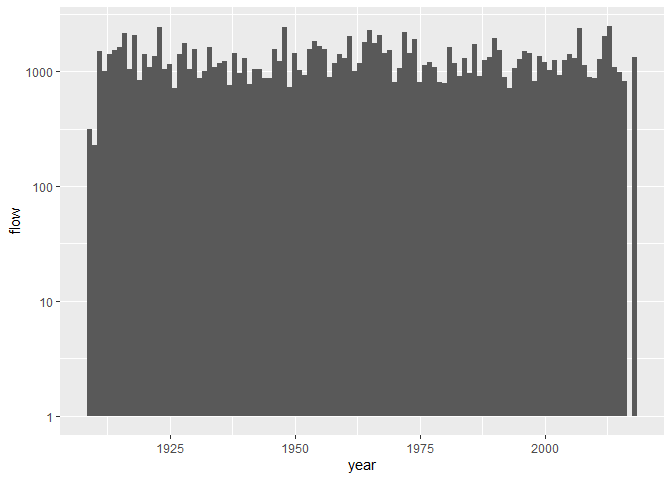
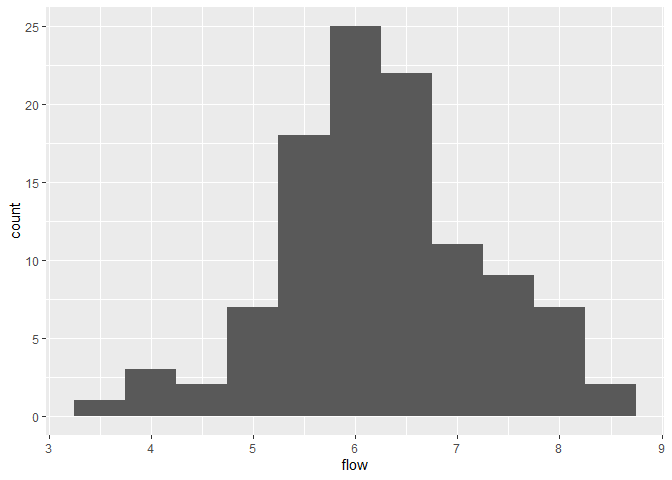
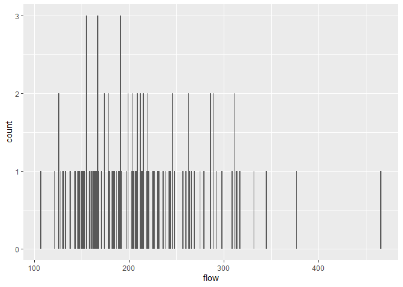
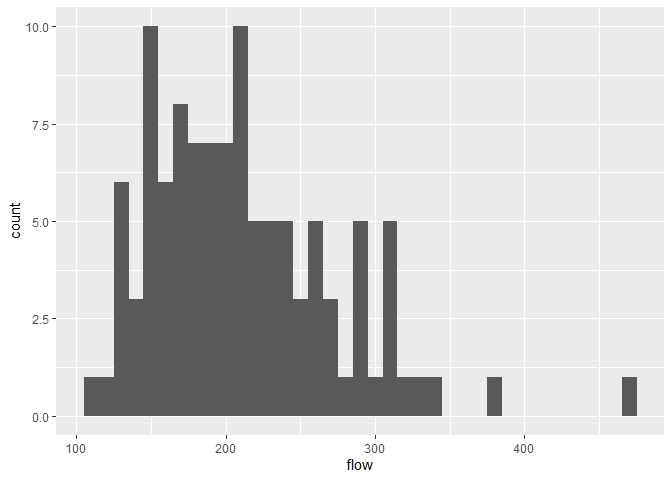
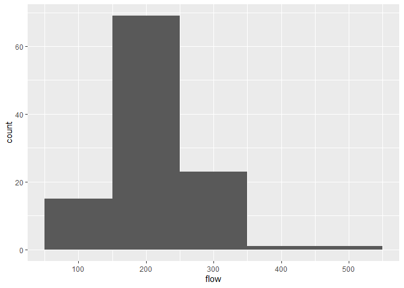

Mini Data Analysis Milestone 2
================

*To complete this milestone, you can either edit [this `.rmd`
file](https://raw.githubusercontent.com/UBC-STAT/stat545.stat.ubc.ca/master/content/mini-project/mini-project-2.Rmd)
directly. Fill in the sections that are commented out with
`<!--- start your work here--->`. When you are done, make sure to knit
to an `.md` file by changing the output in the YAML header to
`github_document`, before submitting a tagged release on canvas.*

# Welcome to the rest of your mini data analysis project!

In Milestone 1, you explored your data. and came up with research
questions. This time, we will finish up our mini data analysis and
obtain results for your data by:

-   Making summary tables and graphs
-   Manipulating special data types in R: factors and/or dates and
    times.
-   Fitting a model object to your data, and extract a result.
-   Reading and writing data as separate files.

We will also explore more in depth the concept of *tidy data.*

**NOTE**: The main purpose of the mini data analysis is to integrate
what you learn in class in an analysis. Although each milestone provides
a framework for you to conduct your analysis, it’s possible that you
might find the instructions too rigid for your data set. If this is the
case, you may deviate from the instructions – just make sure you’re
demonstrating a wide range of tools and techniques taught in this class.

# Instructions

**To complete this milestone**, edit [this very `.Rmd`
file](https://raw.githubusercontent.com/UBC-STAT/stat545.stat.ubc.ca/master/content/mini-project/mini-project-2.Rmd)
directly. Fill in the sections that are tagged with
`<!--- start your work here--->`.

**To submit this milestone**, make sure to knit this `.Rmd` file to an
`.md` file by changing the YAML output settings from
`output: html_document` to `output: github_document`. Commit and push
all of your work to your mini-analysis GitHub repository, and tag a
release on GitHub. Then, submit a link to your tagged release on canvas.

**Points**: This milestone is worth 50 points: 45 for your analysis, and
5 for overall reproducibility, cleanliness, and coherence of the Github
submission.

**Research Questions**: In Milestone 1, you chose two research questions
to focus on. Wherever realistic, your work in this milestone should
relate to these research questions whenever we ask for justification
behind your work. In the case that some tasks in this milestone don’t
align well with one of your research questions, feel free to discuss
your results in the context of a different research question.

# Learning Objectives

By the end of this milestone, you should:

-   Understand what *tidy* data is, and how to create it using `tidyr`.
-   Generate a reproducible and clear report using R Markdown.
-   Manipulating special data types in R: factors and/or dates and
    times.
-   Fitting a model object to your data, and extract a result.
-   Reading and writing data as separate files.

# Setup

Begin by loading your data and the tidyverse package below:

``` r
library(datateachr) # <- might contain the data you picked!
library(tidyverse)
```

    ## Warning: 程辑包'ggplot2'是用R版本4.2.2 来建造的

    ## Warning: 程辑包'stringr'是用R版本4.2.3 来建造的

``` r
library(broom)
library(here)
```

    ## Warning: 程辑包'here'是用R版本4.2.3 来建造的

# Task 1: Process and summarize your data

From milestone 1, you should have an idea of the basic structure of your
dataset (e.g. number of rows and columns, class types, etc.). Here, we
will start investigating your data more in-depth using various data
manipulation functions.

### 1.1 (1 point)

First, write out the 4 research questions you defined in milestone 1
were. This will guide your work through milestone 2:

<!-------------------------- Start your work below ---------------------------->

1.  On which year was the most extreme maximum flow occured?
2.  For how many years do we have 0 as annual minimum flow?
3.  What is the probability of have an annual maximum flow exceeding
    300?
4.  When do we normally observe a maximum flow in a year?
    <!----------------------------------------------------------------------------->

Here, we will investigate your data using various data manipulation and
graphing functions.

### 1.2 (8 points)

Now, for each of your four research questions, choose one task from
options 1-4 (summarizing), and one other task from 4-8 (graphing). You
should have 2 tasks done for each research question (8 total). Make sure
it makes sense to do them! (e.g. don’t use a numerical variables for a
task that needs a categorical variable.). Comment on why each task helps
(or doesn’t!) answer the corresponding research question.

Ensure that the output of each operation is printed!

Also make sure that you’re using dplyr and ggplot2 rather than base R.
Outside of this project, you may find that you prefer using base R
functions for certain tasks, and that’s just fine! But part of this
project is for you to practice the tools we learned in class, which is
dplyr and ggplot2.

**Summarizing:**

1.  Compute the *range*, *mean*, and *two other summary statistics* of
    **one numerical variable** across the groups of **one categorical
    variable** from your data.
2.  Compute the number of observations for at least one of your
    categorical variables. Do not use the function `table()`!
3.  Create a categorical variable with 3 or more groups from an existing
    numerical variable. You can use this new variable in the other
    tasks! *An example: age in years into “child, teen, adult, senior”.*
4.  Compute the proportion and counts in each category of one
    categorical variable across the groups of another categorical
    variable from your data. Do not use the function `table()`!

**Graphing:**

6.  Create a graph of your choosing, make one of the axes logarithmic,
    and format the axes labels so that they are “pretty” or easier to
    read.
7.  Make a graph where it makes sense to customize the alpha
    transparency.

Using variables and/or tables you made in one of the “Summarizing”
tasks:

8.  Create a graph that has at least two geom layers.
9.  Create 3 histograms, with each histogram having different sized
    bins. Pick the “best” one and explain why it is the best.

Make sure it’s clear what research question you are doing each operation
for!

<!------------------------- Start your work below ----------------------------->

``` r
### Research question 1. On which year was the most extreme maximum flow occured?
### 1: range, mean, count, and standard deviation. Now we know that the maximum flow is 466.
# Now we know the flow level of the most extreme maximum flow on record
flow_summary = 
  flow_sample %>% 
  filter(!is.na(flow), !is.na(extreme_type)) %>%
  group_by(extreme_type) %>%
  summarize(minimum = min(flow),
            maximum = max(flow),
            mean = mean(flow),
            count = n(),
            standard_deviation = sd(flow))


### 6. Create a graph of your choosing, make one of the axes logarithmic, and format the axes labels so that they are "pretty" or easier to read.
# It seems that the maximum flow occurred in 2013, although the log scale does not make a better plot.
flow_sample %>%
  ggplot() +
  geom_col(aes(x = year, y = flow)) + 
  scale_y_log10() 
```

    ## Warning: Removed 2 rows containing missing values (position_stack).

<!-- -->

``` r
### Research question 2. For how many years do we have 0 as annual minimum flow?
### 3.  Create a categorical variable with 3 or more groups from an existing numerical variable. 
# We can then use count function on "extreme_type = minimum" and "flow_level = no flow" to get the number of years where annual minimum flow is 0
flow_categorized = 
  flow_sample %>%
  mutate(flow_level = case_when(flow == 0 ~ "no flow",
                                flow <= 100 ~ "low flow",
                                flow <= 300 ~ "medium flow",
                                TRUE ~ "high flow"))

### 9. Create 3 histograms, with each histogram having different sized bins. Pick the "best" one and explain why it is the best.
# To answer the research question, all three of the following histograms suffice (no minimum flow equals to 0). However,histogram with binwidth of 0.5 gives the best illustration of the general distribution of minimum flow.
flow_categorized %>%
  filter(extreme_type == "minimum") %>%
  ggplot(aes(flow)) +
  geom_histogram(binwidth = 0.1)
```

    ## Warning: Removed 2 rows containing non-finite values (stat_bin).

<!-- -->

``` r
flow_categorized %>%
  filter(extreme_type == "minimum") %>%
  ggplot(aes(flow)) +
  geom_histogram(binwidth = 0.5)
```

    ## Warning: Removed 2 rows containing non-finite values (stat_bin).

<!-- -->

``` r
flow_categorized %>%
  filter(extreme_type == "minimum") %>%
  ggplot(aes(flow)) +
  geom_histogram(binwidth = 5)
```

    ## Warning: Removed 2 rows containing non-finite values (stat_bin).

<!-- -->

``` r
### Research question 3. What is the probability of have an annual maximum flow exceeding 300?
### 3.  Create a categorical variable with 3 or more groups from an existing numerical variable. 
# Similar to the last research question, We can then use count function on "extreme_type = maximum" and "flow_level = high flow" to get the number of years where annual manimum flow is above 300
flow_categorized = 
  flow_sample %>%
  mutate(flow_level = case_when(flow == 0 ~ "no flow",
                                flow <= 100 ~ "low flow",
                                flow <= 300 ~ "medium flow",
                                TRUE ~ "high flow"))

### 9. Create 3 histograms, with each histogram having different sized bins. Pick the "best" one and explain why it is the best.
# Histogram with binwidth of 10 is the most appropriate one for the research question and for illustrating the flow distribution. Just by observing, about 5% of the maximum flows were above 300.
flow_categorized %>%
  filter(extreme_type == "maximum") %>%
  ggplot(aes(flow)) +
  geom_histogram(binwidth = 1)
```

<!-- -->

``` r
flow_categorized %>%
  filter(extreme_type == "maximum") %>%
  ggplot(aes(flow)) +
  geom_histogram(binwidth = 10)
```

<!-- -->

``` r
flow_categorized %>%
  filter(extreme_type == "maximum") %>%
  ggplot(aes(flow)) +
  geom_histogram(binwidth = 100)
```

<!-- -->

``` r
### Research question 4. When do we normally observe a maximum flow in a year?
### 4. Compute the proportion and counts in each category of one categorical variable across the groups of another categorical variable from your data.
# Now we know that maximum flows were only observed during May to August, and most frequently in June.
flow_summary_month = 
  flow_sample %>% 
  filter(!is.na(flow), !is.na(extreme_type)) %>%
  group_by(extreme_type, month) %>%
  summarize(count = n(), .groups = "keep")

### 8. Create a graph that has at least two geom layers. 
# Clearly, most maximum flow occured during June.
ggplot(flow_summary_month, aes(x = month, y = count)) +
  geom_col() + 
  geom_label(aes(label = extreme_type), nudge_y = 5, size = 3)
```

<!-- -->

<!----------------------------------------------------------------------------->

### 1.3 (2 points)

Based on the operations that you’ve completed, how much closer are you
to answering your research questions? Think about what aspects of your
research questions remain unclear. Can your research questions be
refined, now that you’ve investigated your data a bit more? Which
research questions are yielding interesting results?

<!------------------------- Write your answer here ---------------------------->

For the following three questions, the above data analysis can fully
answer them: 1. On which year was the most extreme maximum flow occured?
2. For how many years do we have 0 as annual minimum flow? 4. When do we
normally observe a maximum flow in a year?

For question 3, “What is the probability of have an annual maximum flow
exceeding 300?”, the plot can give an approximate answer, but this
answer is not very accurate.

Question 4 did yield suprising result because the data shows that
maximum flows were only observed during summer, and minimum flows were
only observed during the other three season. This is in accordance to
our commonsense because we anticipate greater precipitation and snowmelt
during summer.

Question 2 also yielded interesting result, showing that the minimum
flow never reached 0. This may be because the station is located in a
relatively humid place.

<!----------------------------------------------------------------------------->

# Task 2: Tidy your data

In this task, we will do several exercises to reshape our data. The goal
here is to understand how to do this reshaping with the `tidyr` package.

A reminder of the definition of *tidy* data:

-   Each row is an **observation**
-   Each column is a **variable**
-   Each cell is a **value**

### 2.1 (2 points)

Based on the definition above, can you identify if your data is tidy or
untidy? Go through all your columns, or if you have \>8 variables, just
pick 8, and explain whether the data is untidy or tidy.

<!--------------------------- Start your work below --------------------------->

The “flow_sample” is a tidy data set. Each row corresponds to an
observation of the flow, each column corresponds to a variable, and each
cell corresponds to a value of that variable of that observation.
<!----------------------------------------------------------------------------->

### 2.2 (4 points)

Now, if your data is tidy, untidy it! Then, tidy it back to it’s
original state.

If your data is untidy, then tidy it! Then, untidy it back to it’s
original state.

Be sure to explain your reasoning for this task. Show us the “before”
and “after”.

<!--------------------------- Start your work below --------------------------->

``` r
# untidy the data by expanding the extreme_type column
untidy_flow = pivot_wider(flow_sample, 
                          names_from = extreme_type,
                          values_from = flow)
untidy_flow
```

    ## # A tibble: 218 × 7
    ##    station_id  year month   day sym   maximum minimum
    ##    <chr>      <dbl> <dbl> <dbl> <chr>   <dbl>   <dbl>
    ##  1 05BB001     1909     7     7 <NA>      314      NA
    ##  2 05BB001     1910     6    12 <NA>      230      NA
    ##  3 05BB001     1911     6    14 <NA>      264      NA
    ##  4 05BB001     1912     8    25 <NA>      174      NA
    ##  5 05BB001     1913     6    11 <NA>      232      NA
    ##  6 05BB001     1914     6    18 <NA>      214      NA
    ##  7 05BB001     1915     6    27 <NA>      236      NA
    ##  8 05BB001     1916     6    20 <NA>      309      NA
    ##  9 05BB001     1917     6    17 <NA>      174      NA
    ## 10 05BB001     1918     6    15 <NA>      345      NA
    ## # … with 208 more rows
    ## # ℹ Use `print(n = ...)` to see more rows

``` r
# tidy the data back to the original one
tidy_flow = 
  pivot_longer(untidy_flow, 
               cols = c("maximum", "minimum"), 
               names_to = "extreme_type", 
               values_to = "flow") %>%
  filter(!is.na(flow))
tidy_flow
```

    ## # A tibble: 216 × 7
    ##    station_id  year month   day sym   extreme_type  flow
    ##    <chr>      <dbl> <dbl> <dbl> <chr> <chr>        <dbl>
    ##  1 05BB001     1909     7     7 <NA>  maximum        314
    ##  2 05BB001     1910     6    12 <NA>  maximum        230
    ##  3 05BB001     1911     6    14 <NA>  maximum        264
    ##  4 05BB001     1912     8    25 <NA>  maximum        174
    ##  5 05BB001     1913     6    11 <NA>  maximum        232
    ##  6 05BB001     1914     6    18 <NA>  maximum        214
    ##  7 05BB001     1915     6    27 <NA>  maximum        236
    ##  8 05BB001     1916     6    20 <NA>  maximum        309
    ##  9 05BB001     1917     6    17 <NA>  maximum        174
    ## 10 05BB001     1918     6    15 <NA>  maximum        345
    ## # … with 206 more rows
    ## # ℹ Use `print(n = ...)` to see more rows

<!----------------------------------------------------------------------------->

### 2.3 (4 points)

Now, you should be more familiar with your data, and also have made
progress in answering your research questions. Based on your interest,
and your analyses, pick 2 of the 4 research questions to continue your
analysis in the remaining tasks:

<!-------------------------- Start your work below ---------------------------->

1.  What is the probability of have an annual maximum flow exceeding
    300?
2.  On which year was the most extreme maximum flow occured?

<!----------------------------------------------------------------------------->

Explain your decision for choosing the above two research questions.

<!--------------------------- Start your work below --------------------------->

For question 1: I did not get an accurate probability of exceedance, so
I would like to explore more. For question 2: Although this question was
fully answered in task 1, but the analysis method was not the most
appropriate and required brutal force. We aim to answer that question in
a more clever way.
<!----------------------------------------------------------------------------->

Now, try to choose a version of your data that you think will be
appropriate to answer these 2 questions. Use between 4 and 8 functions
that we’ve covered so far (i.e. by filtering, cleaning, tidy’ing,
dropping irrelevant columns, etc.).

(If it makes more sense, then you can make/pick two versions of your
data, one for each research question.)

<!--------------------------- Start your work below --------------------------->

``` r
### 1.  What is the probability of have an annual maximum flow exceeding 300?
# It is very clear from the following table that there are 10 maximum flows exceeding 300, and the probability of having them is 0.0917.
flow_sample %>%
  filter(!is.na(flow), !is.na(extreme_type)) %>% # remove incomplete observations
  filter(extreme_type == "maximum") %>% #keep maximum observations
  mutate(flow_level = case_when(flow <= 300 ~ "small flow",
                                TRUE ~ "high flow")) %>%
  count(flow_level) %>%
  mutate(prop = prop.table(n))
```

    ## # A tibble: 2 × 3
    ##   flow_level     n   prop
    ##   <chr>      <int>  <dbl>
    ## 1 high flow     10 0.0917
    ## 2 small flow    99 0.908

``` r
### 2.  On which year was the most extreme maximum flow occured?
# The following tibble is beyond what the research question is asking! We know that the most extreme maximum flow occurred on June 21st, 2013, and its level is 466. We can also know that the second most extreme maximum flow occurred on June 14th, 1923, and so on.
flow_sample %>%
  filter(!is.na(flow), !is.na(extreme_type)) %>% # remove incomplete observations
  filter(extreme_type == "maximum") %>% # keep maximum observations
  select(c(year, month, day, flow)) %>% # keep useful information
  arrange(desc(flow))
```

    ## # A tibble: 109 × 4
    ##     year month   day  flow
    ##    <dbl> <dbl> <dbl> <dbl>
    ##  1  2013     6    21   466
    ##  2  1923     6    14   377
    ##  3  1918     6    15   345
    ##  4  2012     6     7   332
    ##  5  1974     6    25   317
    ##  6  1909     7     7   314
    ##  7  1986     6     2   313
    ##  8  1933     6    17   311
    ##  9  1972     6    12   311
    ## 10  1916     6    20   309
    ## # … with 99 more rows
    ## # ℹ Use `print(n = ...)` to see more rows

<!----------------------------------------------------------------------------->

# Task 3: Modelling

## 3.0 (no points)

Pick a research question from 1.2, and pick a variable of interest
(we’ll call it “Y”) that’s relevant to the research question. Indicate
these.

<!-------------------------- Start your work below ---------------------------->
<!----------------------------------------------------------------------------->

Note: There is no such research question in 1.2 that can be resolved
using a model or a hypothesis test. Therefore, I’ll modify this question
“When do we normally observe a maximum flow in a year?” to better fit
the purpose here.

**Research Question**: Fit a linear model of flow level based on the
month of occurance.

**Variable of interest**: flow

<!----------------------------------------------------------------------------->

## 3.1 (3 points)

Fit a model or run a hypothesis test that provides insight on this
variable with respect to the research question. Store the model object
as a variable, and print its output to screen. We’ll omit having to
justify your choice, because we don’t expect you to know about model
specifics in STAT 545.

-   **Note**: It’s OK if you don’t know how these models/tests work.
    Here are some examples of things you can do here, but the sky’s the
    limit.

    -   You could fit a model that makes predictions on Y using another
        variable, by using the `lm()` function.
    -   You could test whether the mean of Y equals 0 using `t.test()`,
        or maybe the mean across two groups are different using
        `t.test()`, or maybe the mean across multiple groups are
        different using `anova()` (you may have to pivot your data for
        the latter two).
    -   You could use `lm()` to test for significance of regression
        coefficients.

<!-------------------------- Start your work below ---------------------------->

``` r
# It doesn't make sense to fit mixed model for both minimum flow and maximum flow,
# so we'll focus on maximum flow for the rest of this problem.
flow_max = flow_sample %>% filter(extreme_type == "maximum")
# fit linear model
flow_month = lm(flow ~ month, data = flow_max)
# print model output
summary(flow_month)
```

    ## 
    ## Call:
    ## lm(formula = flow ~ month, data = flow_max)
    ## 
    ## Residuals:
    ##      Min       1Q   Median       3Q      Max 
    ## -105.090  -46.880   -6.299   33.910  253.910 
    ## 
    ## Coefficients:
    ##             Estimate Std. Error t value Pr(>|t|)   
    ## (Intercept)  201.346     64.900   3.102  0.00246 **
    ## month          1.791     10.788   0.166  0.86848   
    ## ---
    ## Signif. codes:  0 '***' 0.001 '**' 0.01 '*' 0.05 '.' 0.1 ' ' 1
    ## 
    ## Residual standard error: 61.96 on 107 degrees of freedom
    ## Multiple R-squared:  0.0002574,  Adjusted R-squared:  -0.009086 
    ## F-statistic: 0.02755 on 1 and 107 DF,  p-value: 0.8685

<!----------------------------------------------------------------------------->

## 3.2 (3 points)

Produce something relevant from your fitted model: either predictions on
Y, or a single value like a regression coefficient or a p-value.

-   Be sure to indicate in writing what you chose to produce.
-   Your code should either output a tibble (in which case you should
    indicate the column that contains the thing you’re looking for), or
    the thing you’re looking for itself.
-   Obtain your results using the `broom` package if possible. If your
    model is not compatible with the broom function you’re needing, then
    you can obtain your results by some other means, but first indicate
    which broom function is not compatible.

<!-------------------------- Start your work below ---------------------------->

``` r
# tibble containing the estimates, sd's, statistics, and p values of parameters
model_components = tidy(flow_month)
```

<!----------------------------------------------------------------------------->

# Task 4: Reading and writing data

Get set up for this exercise by making a folder called `output` in the
top level of your project folder / repository. You’ll be saving things
there.

## 4.1 (3 points)

Take a summary table that you made from Task 1, and write it as a csv
file in your `output` folder. Use the `here::here()` function.

-   **Robustness criteria**: You should be able to move your Mini
    Project repository / project folder to some other location on your
    computer, or move this very Rmd file to another location within your
    project repository / folder, and your code should still work.
-   **Reproducibility criteria**: You should be able to delete the csv
    file, and remake it simply by knitting this Rmd file.

<!-------------------------- Start your work below ---------------------------->

``` r
write.csv(flow_summary, file = here("output/flow_summary.csv"))
```

<!----------------------------------------------------------------------------->

## 4.2 (3 points)

Write your model object from Task 3 to an R binary file (an RDS), and
load it again. Be sure to save the binary file in your `output` folder.
Use the functions `saveRDS()` and `readRDS()`.

-   The same robustness and reproducibility criteria as in 4.1 apply
    here.

<!-------------------------- Start your work below ---------------------------->

``` r
saveRDS(flow_month, file = here("output/flow_month.RDS"))
readRDS(here("output/flow_month.RDS"))
```

    ## 
    ## Call:
    ## lm(formula = flow ~ month, data = flow_max)
    ## 
    ## Coefficients:
    ## (Intercept)        month  
    ##     201.346        1.791

<!----------------------------------------------------------------------------->

# Overall Reproducibility/Cleanliness/Coherence Checklist

Here are the criteria we’re looking for.

## Coherence (0.5 points)

The document should read sensibly from top to bottom, with no major
continuity errors.

The README file should still satisfy the criteria from the last
milestone, i.e. it has been updated to match the changes to the
repository made in this milestone.

## File and folder structure (1 points)

You should have at least three folders in the top level of your
repository: one for each milestone, and one output folder. If there are
any other folders, these are explained in the main README.

Each milestone document is contained in its respective folder, and
nowhere else.

Every level-1 folder (that is, the ones stored in the top level, like
“Milestone1” and “output”) has a `README` file, explaining in a sentence
or two what is in the folder, in plain language (it’s enough to say
something like “This folder contains the source for Milestone 1”).

## Output (1 point)

All output is recent and relevant:

-   All Rmd files have been `knit`ted to their output md files.
-   All knitted md files are viewable without errors on Github. Examples
    of errors: Missing plots, “Sorry about that, but we can’t show files
    that are this big right now” messages, error messages from broken R
    code
-   All of these output files are up-to-date – that is, they haven’t
    fallen behind after the source (Rmd) files have been updated.
-   There should be no relic output files. For example, if you were
    knitting an Rmd to html, but then changed the output to be only a
    markdown file, then the html file is a relic and should be deleted.

Our recommendation: delete all output files, and re-knit each
milestone’s Rmd file, so that everything is up to date and relevant.

## Tagged release (0.5 point)

You’ve tagged a release for Milestone 2.

### Attribution

Thanks to Victor Yuan for mostly putting this together.
